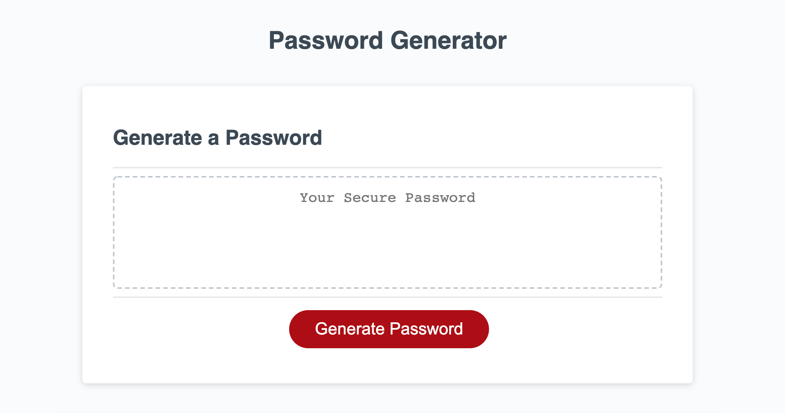

# Password Generator

## About
This password generator allows the user to create a randomized password compiled of numbers, upper and lower case letters, and special characters.

The password generator will allows the user have a chosen length between 8 and 128 characters.

## Methods
This project was created using javascript.

## Preview

